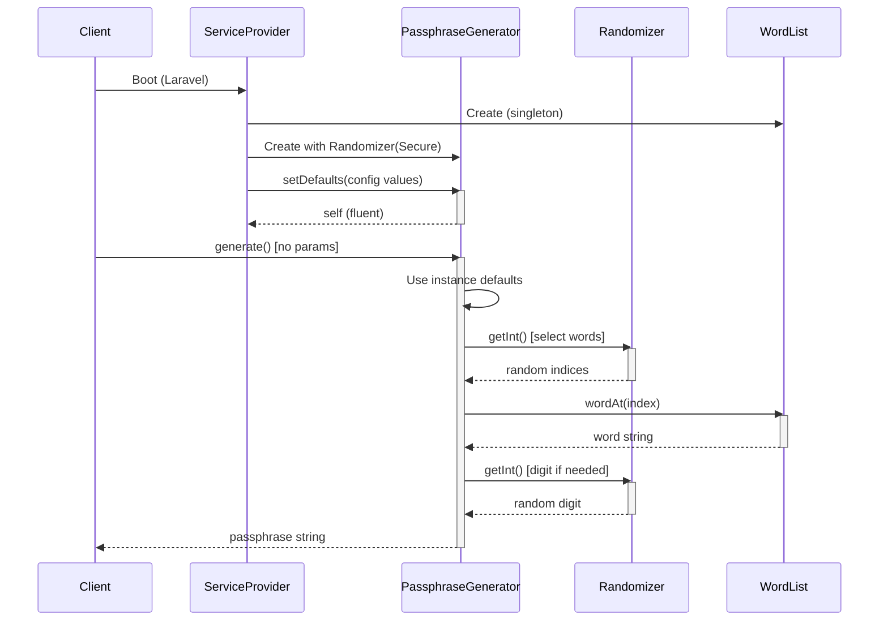

# PHP Passphrase Generator

[](https://packagist.org/packages/nicobleiler/php-passphrase)
[](https://packagist.org/packages/nicobleiler/php-passphrase)
[](https://packagist.org/packages/nicobleiler/php-passphrase)
[](https://github.com/nicobleiler/php-passphrase/actions/workflows/test.yml)
[](LICENSE)

A Bitwarden-inspired passphrase generator for PHP with first-class Laravel integration.

Generates secure, memorable passphrases using the [EFF long word list](https://www.eff.org/dice) (7,776 words) by default, with full support for custom word lists.

## Installation

```bash
composer require nicobleiler/php-passphrase
```

Laravel will auto-discover the service provider. For other frameworks, see [Standalone Usage](#standalone-usage).

## Quick Start

### Laravel (Facade)

```php
use NicoBleiler\Passphrase\Facades\Passphrase;

// Default: 3 words, hyphen separator, no capitalize, no number
Passphrase::generate();
// "candle-rubber-glimpse"

// Customize everything
Passphrase::generate(
    numWords: 5,
    wordSeparator: '.',
    capitalize: true,
    includeNumber: true,
);
// "Candle.Rubber3.Glimpse.Obtain.Willow"
```

### Laravel (Dependency Injection)

```php
use NicoBleiler\Passphrase\PassphraseGenerator;

class AuthController
{
    public function __construct(
        private PassphraseGenerator $passphrase,
    ) {}

    public function temporaryPassword(): string
    {
        return $this->passphrase->generate(
            numWords: 4,
            capitalize: true,
            includeNumber: true,
        );
    }
}
```

### Standalone Usage

```php
use NicoBleiler\Passphrase\PassphraseGenerator;

$generator = new PassphraseGenerator();
echo $generator->generate(); // "candle-rubber-glimpse"
```

You can set instance-level defaults that apply whenever `generate()` is called without explicit parameters:

```php
$generator = new PassphraseGenerator();
$generator->setDefaults(
    numWords: 5,
    wordSeparator: '.',
    capitalize: true,
    includeNumber: true,
);

echo $generator->generate(); // "Candle.Rubber3.Glimpse.Obtain.Willow"

// Explicit params still override defaults
echo $generator->generate(numWords: 3, wordSeparator: '-');
```

### Custom Randomizer

By default, `PassphraseGenerator` uses PHP's cryptographically secure `Random\Engine\Secure`. You can inject a custom `Random\Randomizer` for deterministic output (e.g. testing, demos, reproducible benchmarks):

```php
use NicoBleiler\Passphrase\PassphraseGenerator;
use Random\Engine\Xoshiro256StarStar;
use Random\Randomizer;

$generator = new PassphraseGenerator(
    randomizer: new Randomizer(new Xoshiro256StarStar(12345)),
);

// Same seed always produces the same passphrase
echo $generator->generate(); // deterministic output
```

> **Security note:** Only use non-secure engines for testing or demos. For real passphrase generation, always use the default `Secure` engine.

## Options

| Parameter | Type | Default | Description |
|---|---|---|---|
| `numWords` | `?int` | `3` | Number of words (3–20). `null` uses instance/config default. |
| `wordSeparator` | `?string` | `'-'` | Character(s) between words. `null` uses instance/config default. |
| `capitalize` | `?bool` | `false` | Capitalize the first letter of each word. `null` uses instance/config default. |
| `includeNumber` | `?bool` | `false` | Append a random digit (0–9) to one random word. `null` uses instance/config default. |

All parameters are nullable — passing `null` (or omitting them) uses the defaults set via `setDefaults()` or `config/passphrase.php` in Laravel.

These match [Bitwarden's passphrase generator options](https://bitwarden.com/passphrase-generator/) exactly.

## Configuration

Publish the config file:

```bash
php artisan vendor:publish --tag=passphrase-config
```

This creates `config/passphrase.php`:

```php
return [
    'num_words'      => 3,
    'word_separator'  => '-',
    'capitalize'      => false,
    'include_number'  => false,

    // null = bundled EFF long word list (7,776 words)
    // Or provide your own word list as a PHP array of strings
    'word_list'       => null,
];
```

These config values are automatically used as defaults when calling `Passphrase::generate()` without explicit parameters. You can still override any option per-call.

## Custom Word Lists

### Via Config (Laravel)

Provide `word_list` as a PHP array of strings:

```php
// config/passphrase.php
'word_list' => ['correct', 'horse', 'battery', 'staple'],
```

Or load it from a dedicated PHP file:

```php
// config/passphrase.php
'word_list' => require base_path('config/custom_word_list.php'),
```

```php
// config/custom_word_list.php
<?php

return [
    'correct',
    'horse',
    'battery',
    'staple',
];
```

### Programmatically

```php
use NicoBleiler\Passphrase\WordList;
use NicoBleiler\Passphrase\PassphraseGenerator;

// From an array
$wordList = WordList::fromArray(['correct', 'horse', 'battery', 'staple']);

$generator = new PassphraseGenerator($wordList);
echo $generator->generate(numWords: 4);
```

You can also publish the bundled EFF word list to your resources folder:

```bash
php artisan vendor:publish --tag=passphrase-wordlists
```

This is optional and mainly useful if you want a local copy to inspect or customize. By default, the package reads the bundled EFF list directly.

## How It Works

The generation algorithm mirrors [Bitwarden's Rust implementation](https://sdk-api-docs.bitwarden.com/src/bitwarden_generators/passphrase.rs.html):

### Sequence diagram



## Testing

```bash
composer test
```

Or directly:

```bash
vendor/bin/phpunit
```

The test suite includes tests modeled after Bitwarden's own test cases:

- Validation (word count bounds)
- Deterministic generation with seeded `Xoshiro256StarStar` engine
- Capitalize behavior (including Unicode)
- Number inclusion
- Separator handling (including multi-byte emoji)
- EFF word list integrity
- Laravel integration (service provider, facade, config defaults)
  
## Performance (2026-02-14 02:41:47 MEZ)

These benchmarks were run on a local Ryzen 9 5950X machine running Windows 11 with PHP 8.5.0.

In warm-run benchmarks at similar entropy targets, php-passphrase is ~4.4× faster than genphrase/genphrase and ~1333× faster than martbock/laravel-diceware (based on mean time per generation).

In cold-run benchmarks (startup + first generation), php-passphrase is ~5.6× faster than genphrase/genphrase and ~12.8× faster than martbock/laravel-diceware (based on mean time per generation).

> **Note on cold runs:** `benchGenerateCold` includes setup and first-use initialization (autoloading, object construction, and initial word-list work). Cold-run `rstdev` is therefore expected to be higher and should be interpreted as startup-cost signal, not steady-state throughput.

```
benchGenerateCold
+----------------+-----------------------------------------------------+------+-----+-----------+-----------+---------+----------+
| benchmark      | set                                                 | revs | its | mem_peak  | mode      | mean    | rstdev   |
+----------------+-----------------------------------------------------+------+-----+-----------+-----------+---------+----------+
| ProvidersBench | php-passphrase (EFF 5 words, ~64.6 bits)            | 1    | 20  | 1.614mb   | 127.847μs | 320.5μs | ±241.90% |
| ProvidersBench | genphrase/genphrase (65-bit target, diceware)       | 1    | 20  | 1.364mb   | 1.654ms   | 1.806ms | ±27.58%  |
| ProvidersBench | martbock/laravel-diceware (EFF 5 words, ~64.6 bits) | 1    | 20  | 957.688kb | 3.608ms   | 4.106ms | ±35.28%  |
| ProvidersBench | random_bytes(8) hex (~64 bits)                      | 1    | 20  | 493.784kb | 7.74μs    | 8.8μs   | ±21.14%  |
| ProvidersBench | Illuminate\Support\Str::random(11) (~65.5 bits)     | 1    | 20  | 493.8kb   | 175.25μs  | 241μs   | ±79.83%  |
+----------------+-----------------------------------------------------+------+-----+-----------+-----------+---------+----------+

benchGenerateWarm
+----------------+-----------------------------------------------------+------+-----+-----------+---------+---------+--------+
| benchmark      | set                                                 | revs | its | mem_peak  | mode    | mean    | rstdev |
+----------------+-----------------------------------------------------+------+-----+-----------+---------+---------+--------+
| ProvidersBench | php-passphrase (EFF 5 words, ~64.6 bits)            | 100  | 20  | 494.048kb | 1.596μs | 1.612μs | ±3.79% |
| ProvidersBench | genphrase/genphrase (65-bit target, diceware)       | 100  | 20  | 1.363mb   | 6.956μs | 7.091μs | ±6.42% |
| ProvidersBench | martbock/laravel-diceware (EFF 5 words, ~64.6 bits) | 100  | 20  | 508.944kb | 2.161ms | 2.149ms | ±2.87% |
| ProvidersBench | random_bytes(8) hex (~64 bits)                      | 100  | 20  | 494.04kb  | 0.125μs | 0.125μs | ±7.38% |
| ProvidersBench | Illuminate\Support\Str::random(11) (~65.5 bits)     | 100  | 20  | 494.056kb | 0.56μs  | 0.565μs | ±3.86% |
+----------------+-----------------------------------------------------+------+-----+-----------+---------+---------+--------+
```

## Benchmarking

Run the benchmark suite with:

```bash
composer bench
```

The benchmark suite uses [PHPBench](https://github.com/phpbench/phpbench) and compares providers with near-matched entropy targets.

Each provider is measured in two scenarios:

- `benchGenerateCold` — includes provider setup + first generation (cold start)
- `benchGenerateWarm` — measures steady-state generation after setup warmup

Default stability settings (configured in `phpbench.json`):

- iterations: `20`
- revolutions: `1` (cold subject), `100` (warm subject)
- warmup: `2` (warm subject only)

You can override scale from CLI when needed, for example:

```bash
vendor/bin/phpbench run --report=providers --iterations=40 --revs=5 --retry-threshold=5
```

Compared providers:

- `php-passphrase` with EFF 5 words (~64.6 bits)
- `genphrase/genphrase` with a 65-bit target on diceware mode
- `martbock/laravel-diceware` with EFF 5 words (~64.6 bits)
- `random_bytes(8)` (~64 bits)
- `Illuminate\\Support\\Str::random(11)` (~65.5 bits)

Baseline and comparison runs:

```bash
composer bench:baseline
composer bench:compare
```

## Requirements

- PHP 8.2+
- `ext-mbstring` (for multibyte/Unicode capitalization support)
- Laravel 11+ *(optional, for Laravel integration)*

## License

MIT — see [LICENSE](LICENSE).

## Credits

- Passphrase generation logic inspired by [Bitwarden](https://github.com/bitwarden)
- Word list from the [Electronic Frontier Foundation](https://www.eff.org/dice), licensed under [CC-BY 4.0](https://creativecommons.org/licenses/by/4.0/)
